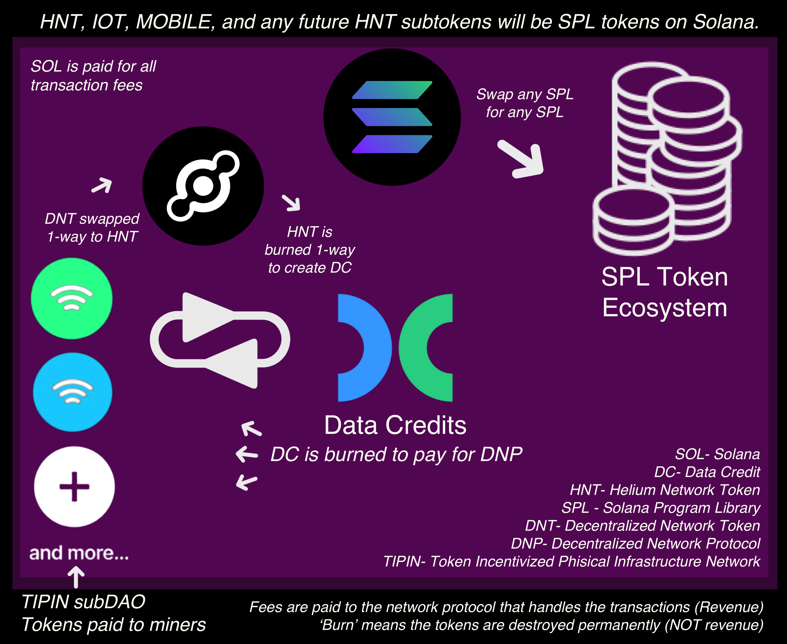

# Helium Solana Support
Various support articles to help folks with Solana related Helium questions. Open an issue for walkthrough requests!

  

# Helium on Solana

Helium Wireless Network is a decentralized wireless network that allows devices to communicate with each other using the LongFi protocol. One exciting aspect of building on the Helium network is the potential to create innovative applications and devices that can benefit from the network's low-power, long-range capabilities. For example, you could build a sensor network for monitoring environmental conditions or a tracking system for inventory management. As a beginner, you can experiment with the Helium network's APIs and software development kits (SDKs) to create your own custom applications and devices.

Solana is a high-performance blockchain that offers fast transaction processing times and low transaction fees. Building on Solana can be exciting for beginners because it enables you to create decentralized applications (dApps) that can be used in a variety of industries, such as finance, gaming, and social media. With Solana's developer tools and resources, beginners can learn how to build dApps that leverage the blockchain's features, such as smart contracts, decentralized storage, and tokenization.

Together, building on the Helium Wireless Network and the Solana blockchain provides a unique opportunity for beginners to explore the possibilities of combining two cutting-edge technologies to create new and innovative solutions. Whether you're interested in creating IoT devices or decentralized applications, both Helium and Solana offer a wealth of resources and support to help you get started.

## Helium Solutions

<li><b>Develop IoT applications:</b> The Helium Network is designed for low-power, long-range IoT devices. Developers can build applications that utilize the network's features, such as LongFi protocol, to create innovative IoT solutions. For example, you could build a smart agriculture system that monitors crop health and weather conditions, or a tracking system for assets in a warehouse.</li>
<li><b>Create custom hardware:</b> The Helium Network is open-source, which means developers can create their own custom hardware that uses the network. You could design a sensor node that measures temperature, humidity, and air quality, or a gateway that connects devices to the network.</li>
<li><b>Build software applications:</b> Helium provides APIs and SDKs that developers can use to build software applications that leverage the network. You could create an application that tracks the location of pets or vehicles, or an app that alerts users when air quality in their area is poor.</li>
<li><b>Participate in mining:</b> Helium is a proof-of-work blockchain, which means community members can participate in mining and earn HNT tokens. You can build your own hotspot, which acts as a gateway to the Helium Network, and earn HNT tokens for providing network coverage.</li>
<li><b>Contribute to the Helium community:</b> Helium has an active and supportive community of developers, enthusiasts, and users. You can contribute to the community by sharing your knowledge and experience, answering questions, and participating in discussions on social media and forums.</li>

## Solana Solutions 

<li><b>Develop decentralized applications (dApps):</b> Solana is a high-performance blockchain that offers fast transaction processing times and low transaction fees. Developers can build dApps that leverage the blockchain's features, such as smart contracts, decentralized storage, and tokenization. You could create a decentralized finance (DeFi) application that allows users to lend and borrow cryptocurrency, or a gaming application that rewards players with digital assets.</li>
<li><b>Create custom tokens:</b> Solana supports the creation of custom tokens, which can be used for a variety of purposes, such as fundraising, loyalty programs, and voting systems. You could create a token that represents ownership in a real-world asset, such as a piece of artwork or a property.</li>
<li><b>Build on Solana's ecosystem:</b> Solana has an ecosystem of tools and resources that developers can use to build on the blockchain. You could create a plugin or extension for Solana's wallet, Sollet, or a tool that helps developers deploy and manage smart contracts.</li>
<li><b>Participate in hackathons:</b> Solana hosts hackathons and other developer events that allow community members to showcase their skills and build innovative solutions on the blockchain. These events often offer prizes and recognition for the best projects.</li>
<li><b>Contribute to the Solana community:</b> Solana has an active and supportive community of developers, enthusiasts, and users. You can contribute to the community by sharing your knowledge and experience, answering questions, and participating in discussions on social media and forums.</li>

## Solana Builders!

The Solana Ecosystem just turned 3! She's young, and moving fast. Learning developing on Solana can be tricky for this reason. You may find that walkthroughs from 4-6 months ago are nearly obsolete as modules get renamed, sunsetted, or replaced. Chances are, copy pasting your terminal errors into google won't yield any results. A wise builder once said "if there's copy-code base available for what you're building, you're already late. If there's not, you're onto something before the rest of the world and it's on you to create the docs you seek!"

Buildspace was the most help for me, but they just announced 'buildspace is dead' and are opening a school. Give it a shot though and see what you can complete, the struggle is valuable to the learning. I'll do my best to try to highlight tutorials and courses here that took the fewest years off my life.

# General Safety Tips

<a href="https://github.com/ilovespectra/helium-solana-support/blob/main/walkthroughs/general-safety.md" target="_blank">General Safety on Solana</a>

## Ecosytem Docs

<a href="https://docs.solana.com/" target="_blank">Solana Docs</a>

<a href="https://docs.helium.com/" target="_blank">Helium Docs</a>

## Boot Camps

<a href="https://buildspace.so/builds" target="_blank">Buildspace</a>
<i> - I strongly recommend trying the Buildspace 'Solana Core'</i>  
<a href="https://docs.solana.com/getstarted/hello-world" target="_blank">Solana Developer Resources</a>  
<a href="https://www.alchemy.com/solana" target="_blank">Alchemy</a>

## Walkthroughs

<a href="https://github.com/ilovespectra/helium-solana-support/blob/main/walkthroughs/helium-wallet-devnet-sol.md" target="_blank">Preview Solana Experience / Airdrop</a>

<a href="https://github.com/ilovespectra/helium-solana-support/blob/main/walkthroughs/faq.md" target="_blank">FAQs</a>

<a href="https://github.com/ilovespectra/helium-solana-support/blob/main/walkthroughs/request-usdc.md" target="_blank">Requesting USDC on Phantom</a>

<a href="https://github.com/ilovespectra/helium-solana-support/blob/main/walkthroughs/send-usdc.md" target="_blank">Sending USDC on Phantom</a>

<a href="https://github.com/ilovespectra/helium-solana-support/blob/main/walkthroughs/swapping.md" target="_blank">Swapping SPL Tokens using Phantom</a>

## Educational / Safety

<a href="https://github.com/ilovespectra/helium-solana-support/blob/main/walkthroughs/hnt-on-sol.md" target="_blank">Helium Native Token (HNT) on Solana</a>

<a href="https://github.com/ilovespectra/helium-solana-support/blob/main/walkthroughs/nft-safety.md" target="_blank">NFT/SFT Token Safety</a>

## Communities
<a href="https://discord.gg/solana-community-926762104667648000" target="_blank">Solana Discord</a><i> - Official Solana community Discord</i>  
<a href="https://discord.gg/helium" target="_blank">Helium Discord</a><i> - Official Helium community Discord</i>  
<a href="https://discord.gg/VcfJSfCJ" target="_blank">Metaplex Discord</a><i> - Official Metaplex community Discord</i>  
<a href="https://discord.gg/BaKgX442" target="_blank">Grizzlython Discord</a><i> - Solana's leading developers competing for huge prizes. A great knowledge base if you don't mind bothering the pros</i>  
<a href="https://solana.stackexchange.com/" target="_blank">Solana Stack Exchange</a><i> - A Q&A website for Solana developers</i>  
<a href="https://stackoverflow.com/" target="_blank">Stack Overflow</a><i> - Another Q&A website for developers</i>  

## Resources

<a href="https://solanacookbook.com/#contributing" target="_blank">Solana Cookbook</a>  
<a href="https://docs.alchemy.com/docs/welcome-to-the-road-to-web3" target="_blank">Alchemy Road to Web3</a>  
<a href="https://docs.metaplex.com/" target="_blank">Metaplex Docs</a>  

## Inspiration 

<a href="https://github.com/ilovespectra/helium-solana-support/tree/main/walkthroughs/free-ideas.md" target="_blank">32 ideas</a> - 32 different projects that would leverage Helium-enabled devices for DApps on the Solana blockchain.

