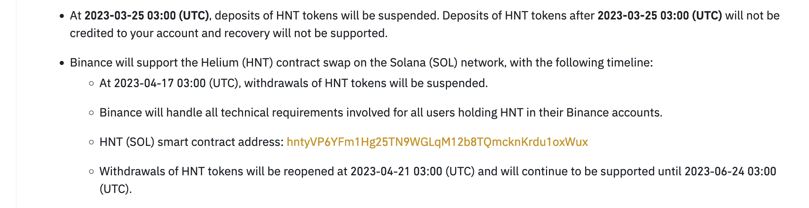

# As a Helium Hotspot owner / HNT holder / etc. 
WHAT DO I NEED TO DO before/after the migration?
# Nothing
Your hotspots will be automatically transferred to your new Solana address 
Your HNT will be automatically transferred to your new Solana address 
Your hotspot NFTs will appear in your wallet automatically 

HNT held in exchange accounts should be snapshot and migrated to new Solana addresses, which is how it should also work in your Helium Wallet App for example.

# What if I have a Ledger?
Depends on what's on it. If you've got HST, veHNT, hotspots, Mobile, or otherwise, the word from Helium devs is to temporarily move those to the Helium Wallet App. If you've just got HNT in there, you can simply wait til after the migration. The team said they would release a 'click-next'-style migration wizzard to help.

# Is HNT dead?
HNT is the Helium Native Token. The Helium Network currently runs a L1, or Layer 1, blockchain. 
HNT will become a SPL token on the Solana blockchain, meaning ALL HNT anywhere you see it listed today
will be 'de-listed' and will have to be 're-listed' as SPL HNT on Solana. The name will not change, but the token contract is on a totally different blockchain.  
ALL HNT will become an SPL token. Neither the Helium Network, nor the Native Token, are going away after the migration.   Those of us building on Solana believe the contrary.

# Why Binance delist?
Read that last section again.  
<b>ALL HNT anywhere you see it listed today
will be 'de-listed' and have to be 're-listed' as SPL HNT on Solana</b> This is a technicality, the language is confusing. <a href="https://cryptoslate.com/binance-misallocates-20m-heliums-hnt-tokens-in-mistake/" target="_blank">Binance has lost millions of dollars before</a> due to failing to update their system to keep up with Helium. Stopping trading is a simple way for them to insulate themselves from another easily preventable mistake. 

# When Binance relist?
Ask Binance. 
This is <a href="https://www.binance.com/en/support/announcement/binance-will-delist-hnt-and-wabi-on-2023-03-24-f1a8aa29692b4442a8f18be2076e14a0" target="_blank">Binance's official announcement</a>

  

 Key points:  

<b>Binance will support the Helium (HNT) contract swap on the Solana (SOL) network</b>

    Binance will handle all technical requirements involved for all users holding HNT in their Binance accounts.

and
  
    Withdrawals of HNT tokens will be reopened at 2023-04-21 03:00 (UTC) and will continue to be supported until 2023-06-24 03:00 (UTC).
