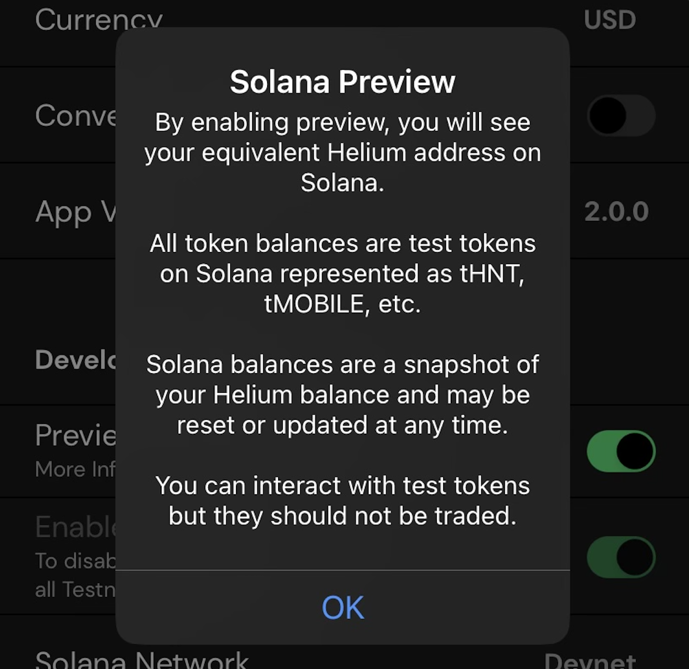
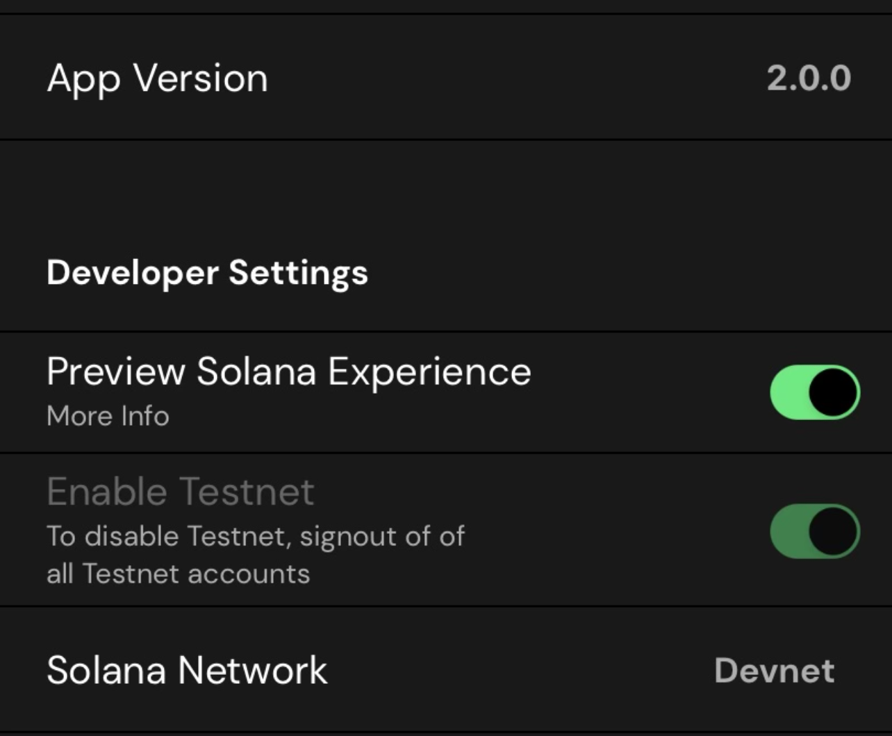
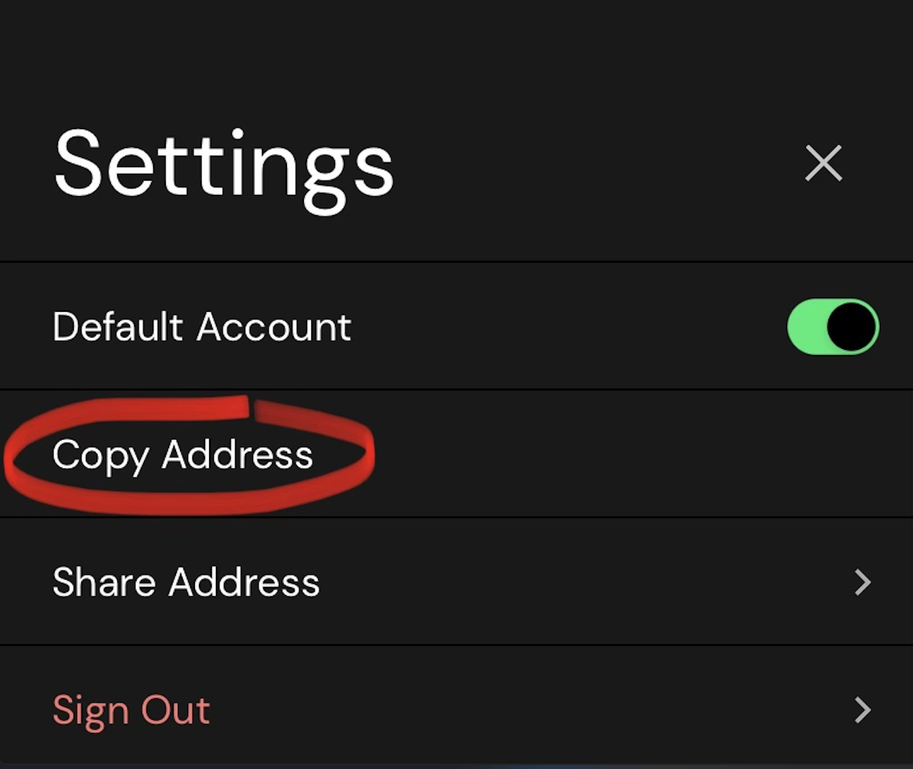
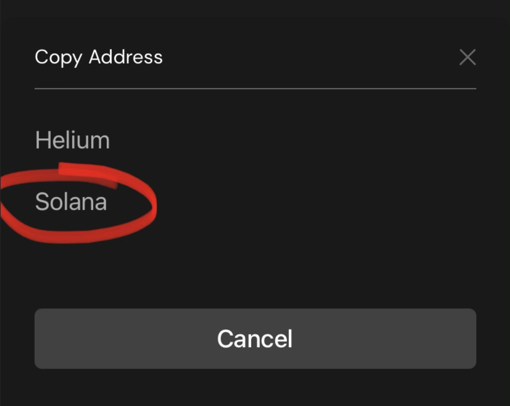
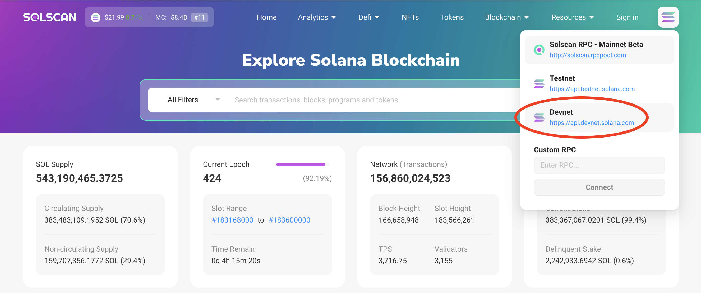
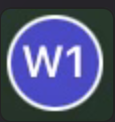
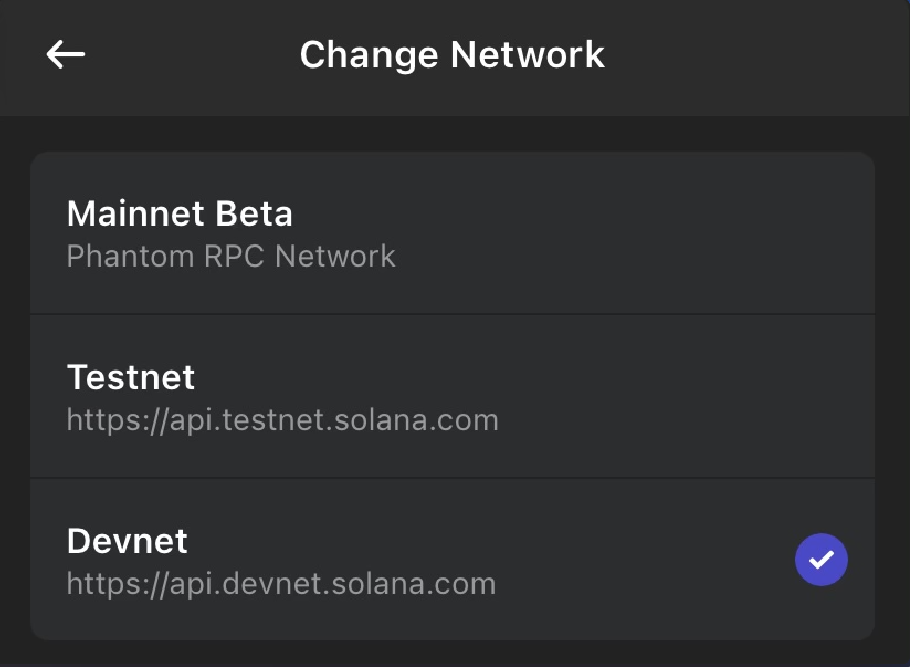
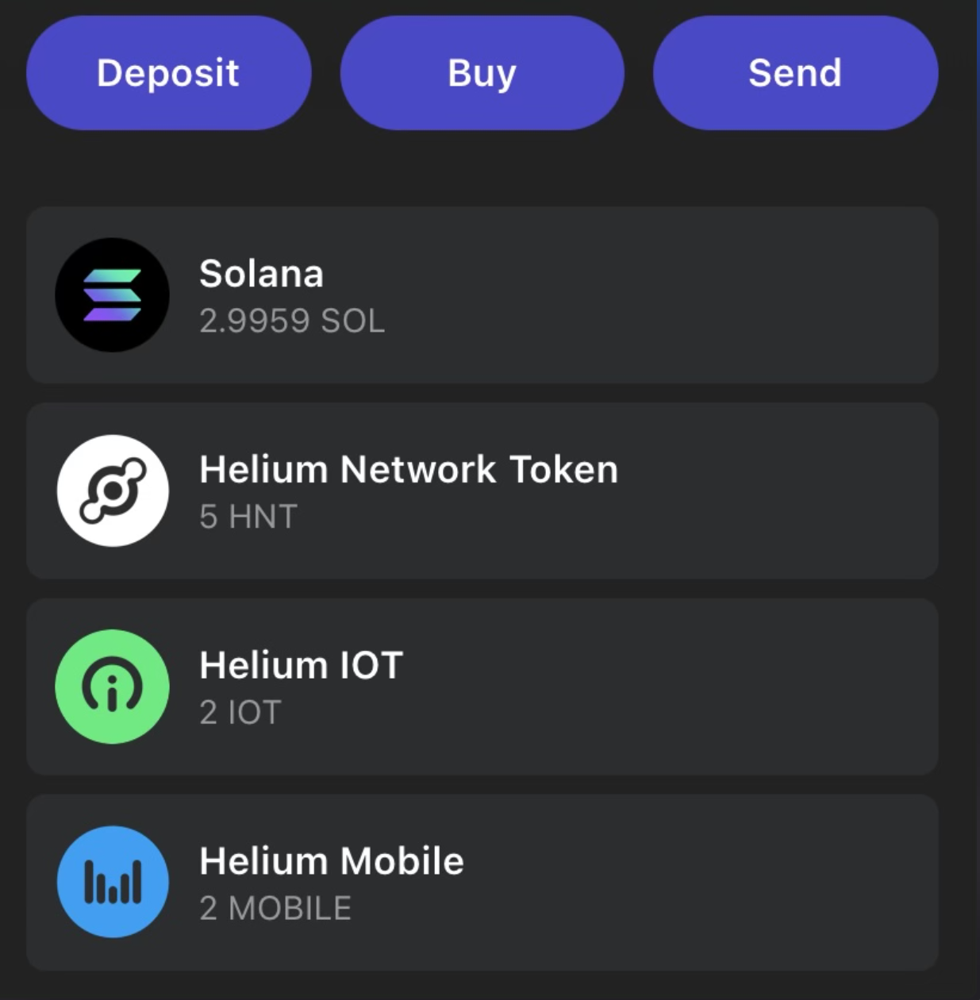

# Preview Solana Experience / Airdrop devnet SOL!

This tutorial will allow you to Preview the Solana experience in your <a href="https://docs.helium.com/wallets/helium-wallet-app/" target="_blank">Helium Wallet App</a>
and, after <a href="https://docs.solana.com/cli/install-solana-cli-tools" target="_blank">installing the Solana Tool Suite CLI</a> on your machine, airdrop yourself some devnet SOL, HNT, IOT, and MOBILE.<br>
<p align="center">

  </p>

## Remember!
Your seedphrase is your password to your wallet. Do not share it with anyone. Do not screen shot, email, or text it to yourself. Write it on paper or engrave it in metal and <b>DO NOT LOSE IT</b>. The devnet is a real copy of the Solana blockchain being provided to allow builders to deploy programs and test transactions.
If you want to build projects of your own, you may need devnet tokens. Here's how to get them!
<br>
## Installing Solana Tool Suite CLI
<a href="https://docs.solana.com/cli/install-solana-cli-tools" target="_blank">Click this link</a> and proceed with the steps required for your machine.
## Update the Helium Wallet App
The <a href="https://docs.helium.com/wallets/helium-wallet-app/" target="_blank">Helium Wallet App</a> is the official open source wallet for Helium. Either download or update to the latest version.
## Enable Solana Experience
Select the settings gear icon from within the Helium wallet app, scroll to the bottom, and toggle on <b>Preview Solana Experience</b><br>
<p align="center">

  </p>
  
## Copy your address <br>
Click the settings icon and click `Copy Address`, then `Solana`:
<p align="center">

  </p>
<p align="center">

  </p>
<br>
And go paste it in <a href="https://solscan.io/" target="_blank">Solscan</a> and see your new Helium Wallet address on Solana!
<br><br>Swap to devnet on Solscan:<br>
<p align="center">

  </p>
<i>Your Helium wallet address on Solana devnet should already have 1 devnet SOL in there. Neat huh?</i>

## Airdrop SOL!
So if you just installed the Solana Tool Suite CLI, you may have just had your first dance with your computer's terminal. <b>GET USED TO IT</b> because it's addicting, and before long you may find yourself taking a Solana boot camp like me!
The airdrop is simple, just open up a new terminal window and enter this: 
```
solana airdrop 2 <YOUR_ADDRESS> --url devnet
```
<i>(Remember to replace `<YOUR_ADDRESS>` with your Solana Helium wallet address from above.)</i><br><br>
You should now see the devnet SOL in your Helium Wallet App!
## Airdrop IoT/MOBILE/HNT
This is a whole lot easier, all you have to do is paste this in your web browser and replace <your-wallet> with your wallet address and viola!:
```
https://faucet.web.test-helium.com/mobile/<your-wallet>?amount=5
```
You may receive an error that says `Too Many Requests`, but alas, check your wallet again! You should see your new devnet Mobile tokens!
All you have to do is change `mobile` to `iot` or even `hnt` to get test tokens into your wallet to begin experimenting with your devnet programs. 
It is valuable to keep in mind that devnet tokens are not worth real money, but running the devnet validators takes real resources, so don't abuse this 
by spamming for multiple requests. There's nothing you can do with 1,000,000 devnet tokens that you can't do with 10.
<br><br>
Now go have fun and build something!
## View HNT on Phantom
HNT, IOT, MOBILE, and all future subDAO tokens on the Helium flywheel will be SPL tokens, a popular standard supported by a variety of platforms, exchanges, IDEs, etc. To view your devnet tokens in your Solana Phantom wallet, swap to devnet in the Phantom settings by pressing the  icon in the top left corner:<br>
<p align="center">

  </p>
Simply copy your Phantom wallet address, and send yourself some devnet tokens from the Helium wallet app. 
<br><i>Your wallet address is the same accross the mainnet, testnet, and devnet networks. This goes for your seedphrase as well!</i><br><b>DO NOT COMPRIMISE YOUR WALLET BY SHARING YOUR "DEVNET SEEDPHRASE", you only have one seedphrase!</b><br><br>
<p align="center">

  </p>
